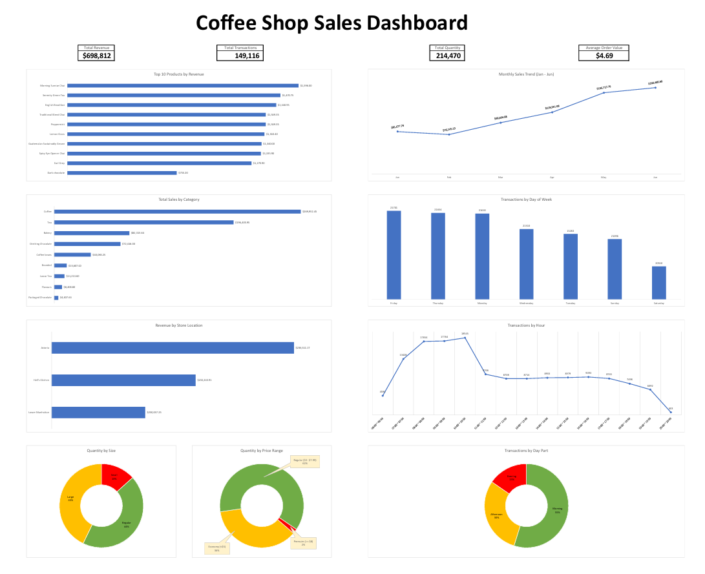

# ☕ Coffee Shop Sales Dashboard

## 📌 Project Overview
This project involves analyzing sales data for a coffee shop to identify key business trends, top-performing products, and customer behavior patterns. The goal was to transform raw transaction records into an interactive and visually compelling dashboard using **Microsoft Excel**.

## 📊 Key Features
The dashboard provides a comprehensive view of the business performance through:

* **KPIs:** Tracking Total Revenue, Total Transactions, Total Quantity Sold and Average Order Value.
* **Product Analysis:**
    * Top 10 Products by Revenue.
    * Sales by Product Category.
* **Time Analysis:**
    * Monthly Sales Trend (Jan - June).
    * Peak Sales Hours & Days of the Week.
    * Transactions by Time of Day (Morning, Afternoon, Evening).
* **Customer Preferences:**
    * Quantity by Cup Size (Large, Regular, Small).
    * Quantity by Price Range.
* **Location Analysis:** Revenue performance across different store branches.

## 🛠️ Tools & Technologies
* **Microsoft Excel:** The core tool used for the entire project.
    * **Data Cleaning:** Processing raw data to ensure accuracy and consistency.
    * **Advanced Formulas:** Utilizing functions like `SUMIF`, `COUNTIF`, and `VLOOKUP` to create dynamic calculation tables.
    * **Data Visualization:** Designing custom charts (Bar, Line, Column, Doughnut) with clean aesthetics and proper data-ink ratio.
    * **Dashboard Design:** Applying UI/UX principles (alignment, white space, color consistency) to create a professional, app-like interface.

## 📂 Project Structure
The Excel file consists of three main sheets:
1.  **Dashboard:** The final interactive visual interface.
2.  **Calculations:** The "engine" room where raw data is aggregated using formulas.
3.  **Data:** The raw dataset containing transaction records.

## 🚀 How to Use
1.  Download the file `Coffee_Shop_Sales_Dashboard.xlsx`.
2.  Open it in Microsoft Excel.
3.  Explore the dashboard! (The visual elements are responsive to layout changes).
4.  You can also view the PDF version `Coffee_Shop_Sales_Report.pdf` for a quick summary.

## 💾 Data Source
The dataset used in this project was provided by **Maven Analytics**.
* **Dataset Name:** Coffee Shop Sales
* **Link:** [Maven Analytics Data Playground](https://mavenanalytics.io/data-playground/coffee-shop-sales)

---
**Author:** [Mohamed Elmustafa Ahmed](https://github.com/mohmusahm2000)
